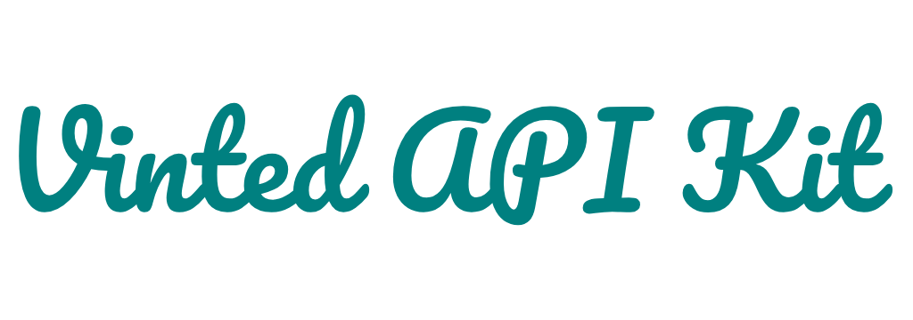

<div align="center">



***Lightweight asynchronous Python client library for accessing Vinted API and scraping item data.***

[](LICENSE)

</div>

---
## ✨ Features

- 🚀 **Asynchronous** - Built with asyncio for high performance
- 🌍 **Multi-locale** - Supports multiple Vinted domains (FR, DE, US, etc.)
- 🔍 **Item Search** - Search catalog with filters and pagination
- 📦 **Item Details** - Get complete item information
- 🍪 **Cookie Persistence** - Automatic session management
- 🔐 **Proxy Support** - Built-in proxy configuration
- 📊 **Type Hints** - Full typing support for better IDE experience

---
## 📚 Table of Contents

- [Installation](#installation)
- [Quick Start](#quick-start)
- [Configuration](#configuration)
- [Development](#development)
- [Changelog](#changelog)
- [License](#license)

---
## Installation

Install via pip:
```bash
pip install vinted-api-kit
```
Or using poetry:
```bash
poetry add vinted-api-kit
```

---
## Quick Start

```python
import asyncio
from vinted_api_kit import VintedApi, CatalogItem, DetailedItem

async def main():
    async with VintedApi(locale="fr") as vinted:
        # Get detailed item information
        item_detail: DetailedItem = await vinted.item_details(
            url="https://www.vinted.fr/items/922704975-adidas-x-15"
        )
        print(f"📦 {item_detail.title}")
        print(f"💰 {item_detail.price}\n")

        # Search for items
        items: list[CatalogItem] = await vinted.search_items(
            url="https://www.vinted.fr/catalog?search_text=adidas",
            per_page=5
        )

        print("🔍 Search results:")
        for item in items:
            print(f"  • {item.title} - {item.price} {item.currency}")

if __name__ == "__main__":
    asyncio.run(main())
```

---
## Configuration

### Basic usage
```python
from vinted_api_kit import VintedApi

async with VintedApi(locale="fr") as vinted:
    pass
```

### Advanced configuration
```python
from vinted_api_kit import VintedApi

async with VintedApi(
    locale="de",
    proxies={"http": "http://proxy:8080"},
    client_ip="192.168.1.1",
    cookies_dir="./cookies",
    persist_cookies=True
) as vinted:
    pass
```

**Parameters:**
- `locale` - Vinted domain locale (`'fr'`, `'de'`, `'us'`, etc.)
- `proxies` - Proxy configuration (requests format)
- `client_ip` - Override client IP header
- `cookies_dir` - Directory for cookie storage
- `persist_cookies` - Enable/disable cookie persistence

These can be set when creating an instance of the `VintedApi` class.

No additional environment variables are required by default.

---
## 🛠️ Development

### Setup
```shell
git clone https://github.com/vlymar1/vinted-api-kit.git
cd vinted-api-kit
```
*Install dependencies (you'll need to set up your dev environment)*
### Testing

```shell
make test-coverage # run tests with coverage
make test-coverage-view # view coverage report in browser
```

### Code Quality

```shell
make lint-check # check code with ruff and mypy
make lint-reformat # format and fix code with ruff
```

### Cleanup

```shell
make clean # remove cache files and build artifacts
```

**Development Guidelines:**
- Follow PEP8 style guidelines
- Configure ruff in `pyproject.toml` for your preferred rules
- Set up pre-commit hooks for automatic linting
- Contributions welcome! Please open issues or pull requests

---
## Changelog

See [`CHANGELOG.md`](CHANGELOG.md) for the list of notable changes per version.

### How to create and maintain changelog?

- Start a `CHANGELOG.md` file at the root of your repo.
- Follow [Keep a Changelog](https://keepachangelog.com/en/1.0.0/) format for consistent structure.
- For each release version, record:
  - Added — new features
  - Changed — updates/improvements
  - Fixed — bug fixes
  - Removed — deprecated or removed features
- Update changelog **before** tagging a new release (e.g., `v1.0.0`).
- Automate changelog generation optionally by tools such as:
  - [github-changelog-generator](https://github.com/github-changelog-generator/github-changelog-generator)
  - [auto-changelog](https://github.com/CookPete/auto-changelog)
  - Conventional commits combined with [semantic-release](https://semantic-release.gitbook.io/semantic-release/)

---
## License

This project is licensed under the MIT License - see the [LICENSE](LICENSE) file for details.

---
## Maintainers / Contacts

- GitHub: [https://github.com/vlymar1](https://github.com/vlymar1)

Feel free to open issues or contact for support and collaborations.
